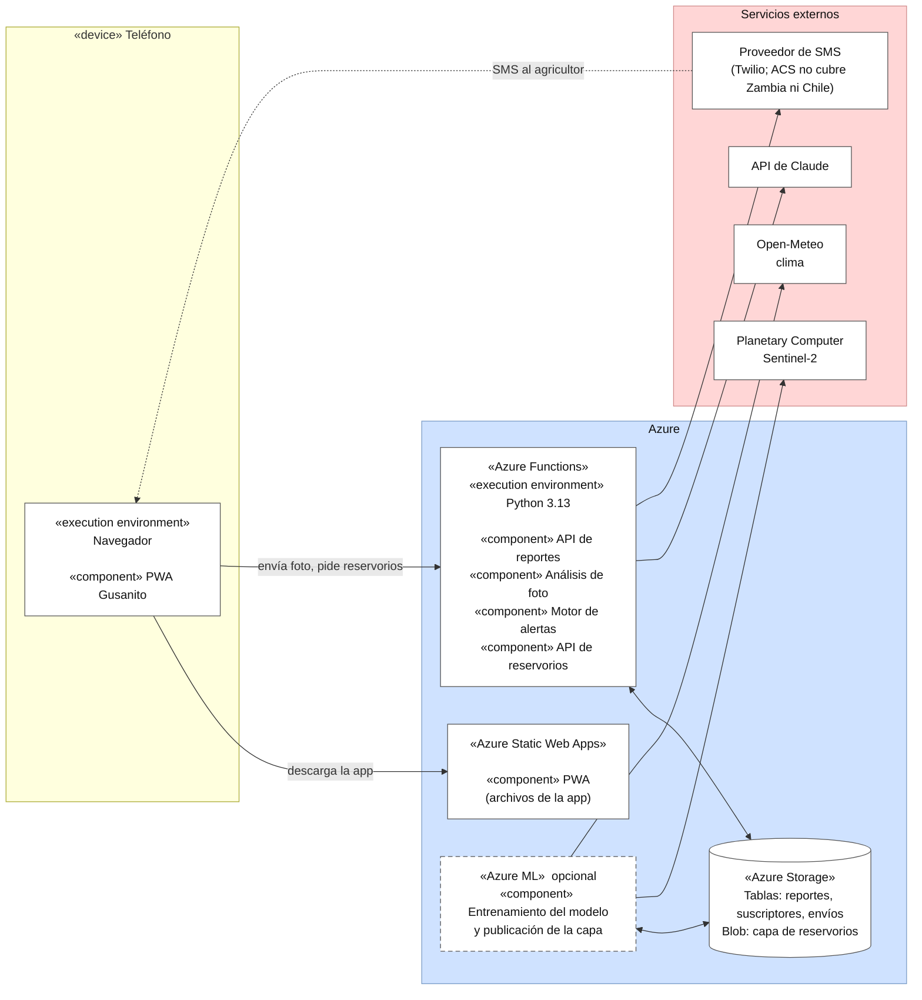

# Diagrama de despliegue (versión simple)

Versión corregida de la que se dibujó a mano, para presentar. Detalle completo en [`diagrama-despliegue.md`](diagrama-despliegue.md).

```mermaid
flowchart LR
  subgraph TEL["«device»  Teléfono"]
    NAV["«execution environment»<br/>Navegador<br/><br/>«component» PWA Gusanito"]
  end

  subgraph AZ["Azure"]
    direction LR
    SWA["«Azure Static Web Apps»<br/><br/>«component» PWA<br/>(archivos de la app)"]
    FN["«Azure Functions»<br/>«execution environment» Python 3.13<br/><br/>«component» API de reportes<br/>«component» Análisis de foto<br/>«component» Motor de alertas<br/>«component» API de reservorios"]
    DB[("«Azure Storage»<br/>Tablas: reportes, suscriptores, envíos<br/>Blob: capa de reservorios")]
    ML["«Azure ML»  opcional<br/>«component» Entrenamiento del modelo<br/>y publicación de la capa"]
  end

  subgraph EXT["Servicios externos"]
    direction TB
    CL["API de Claude"]
    SMS["Proveedor de SMS<br/>(Twilio; ACS no cubre Zambia ni Chile)"]
    SAT["Planetary Computer<br/>Sentinel-2"]
    CLI["Open-Meteo<br/>clima"]
  end

  NAV -->|"descarga la app"| SWA
  NAV -->|"envía foto, pide reservorios"| FN
  FN <--> DB
  FN --> CL
  FN --> SMS
  SMS -.->|"SMS al agricultor"| NAV
  ML <--> DB
  ML --> SAT
  ML --> CLI

  classDef zone fill:#cfe2ff,stroke:#7a9cc6,color:#111
  classDef ext fill:#ffd6d6,stroke:#d08a8a,color:#111
  classDef box fill:#ffffff,stroke:#555,color:#111
  class AZ zone
  class EXT ext
  class NAV,SWA,FN,DB,ML,CL,SMS,SAT,CLI box
  style ML stroke-dasharray: 6 4
```
